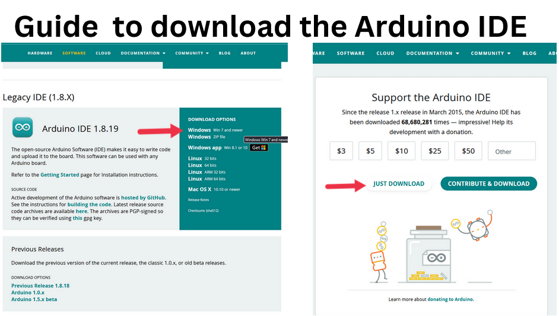
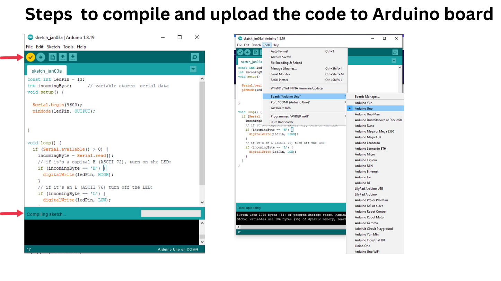
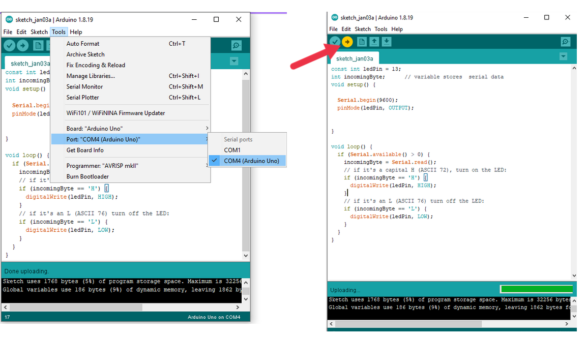

# Controlling the led using Python on Arduino board

Resources and Steps to start a project.

## Download Arduino IDe : https://www.arduino.cc/en/software

#Go to Arduino code folder and open the #led.ino with Arduion IDE.

## download opencv-python:https://pypi.org/project/opencv-python/

Downloading and Installing OpenCV:

OpenCV can be directly downloaded and installed with the use of pip (package manager). 

To install OpenCV, just go to the command-line and type the following command:

$pip install opencv-python3

$pip install pyserial.
