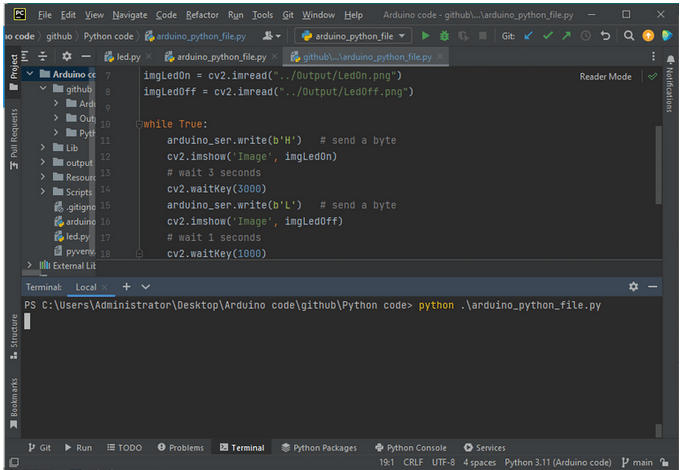

# Controlling the led using Python on Arduino board

Resources and Steps to start a project.

## Download Arduino IDe : https://www.arduino.cc/en/software

#Go to Arduino code folder and open the #led.ino with Arduion IDE.

## download opencv-python:https://pypi.org/project/opencv-python/
#Go to Arduino code folder and open the #led.ino with Arduion IDE.

.Install Python programming language : https://www.python.org/
## Download Pycharm IDE: https://www.jetbrains.com/pycharm/download/#section=windows

#Go to Python folder and open the arduino_python_file.py with pycharm

.download and install opencv-python:https://pypi.org/project/opencv-python/

#OR
->OpenCV can be directly downloaded and installed with the use of pip (package manager). 

To install OpenCV, just go to the command-line and type the following command:

->$pip install opencv-python3

->$pip install pyserial.

#Finaly run the code: python arduino_python_file.py

#OUtput

you will see the pin number 13 is start to blink.

Done!

